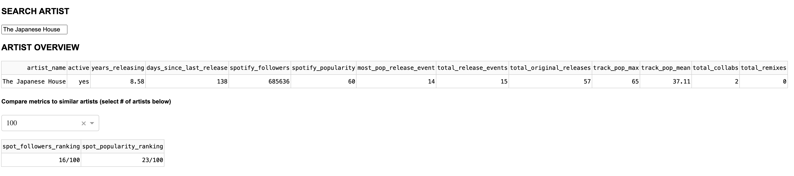
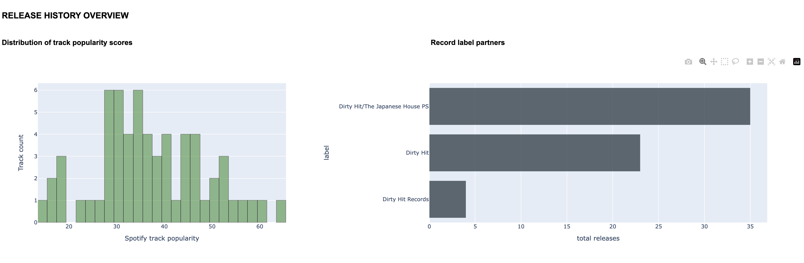
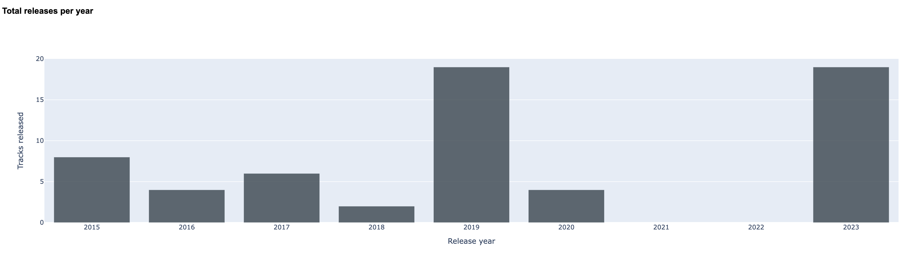
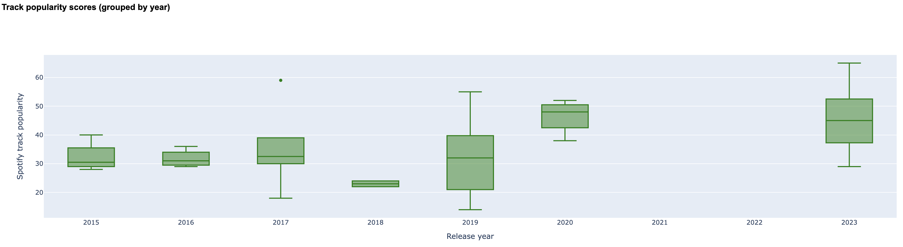
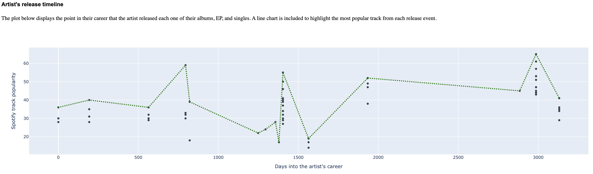
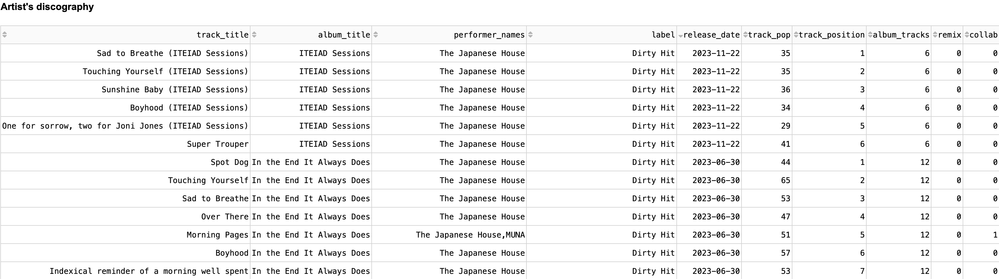

<!-- Control + Shift + M to preview -->

# **Artist Dashboard**

This repository contains multiple scripts that work together to create an interactive dashboard that gives one the ability to analyze and visualize any artist's Spotify data. To set up this dashboard, a Dash web app was created inside the 'artist_dashboard.py' file. The primary purpose of the other scripts in this repository is to retrieve and process the artist/track data that's returned by the Spotify Web API. Once the installation steps below have been completed, you can use this dashboard to look up an artist of interest and quickly gain insight into the act's release history and overall career.

### Prerequisites

To interact with the Spotify Web API, you'll first need a 'Client ID' and 'Client Secret'. You'll also want to install the packages inside the 'requirements.txt' file.

### Installation

1. Obtain your 'Client ID' / 'Client Secret'. Instructions for how to do this can be found [here](https://developer.spotify.com/documentation/web-api/tutorials/getting-started)
2. Clone this repository
   ```sh
   git clone https://github.com/ChrisSunderland/artist_dashboard
   ```
3. Create a .env file in your local repository
4. Create two variables in the .env file to store your assigned 'Client ID' and 'Client Secret'. Name these 'client_id' and 'client_secret'.
5. Install the packages found inside the 'requirements.txt' file
   ```sh
   pip install -r requirements.txt
   ```
6. Run the 'artist_dashboard.py' script

  ```sh
  python3 artist_dashboard.py
  ```
7. Navigate to the URL that's returned by the program. This will take you to the Dash web app where you'll find the dashboard.

### Usage

Once you're on the dashboard, simply type the name of an artist inside the search bar at the top of the page. Once this happens, the program will retrieve the artist's Spotify data and the tables/plots on the dashboard will update automatically. I've included screenshots below so you can see the layout of the dashboard for an example artist.








